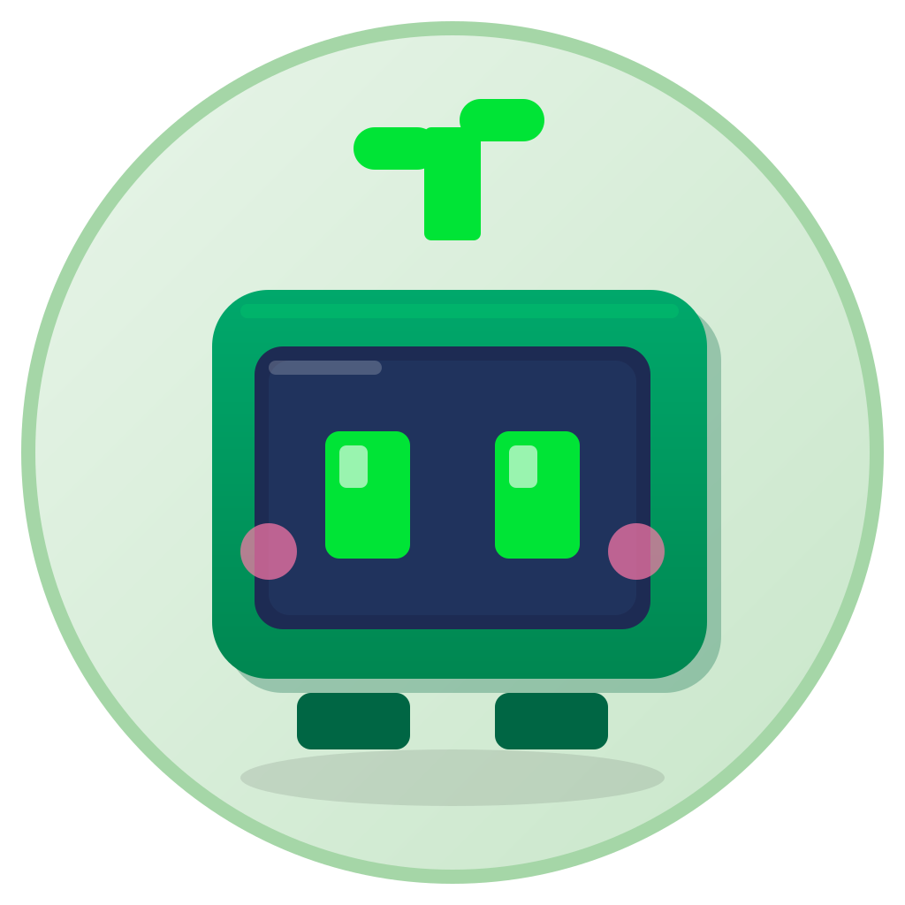
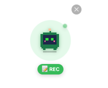
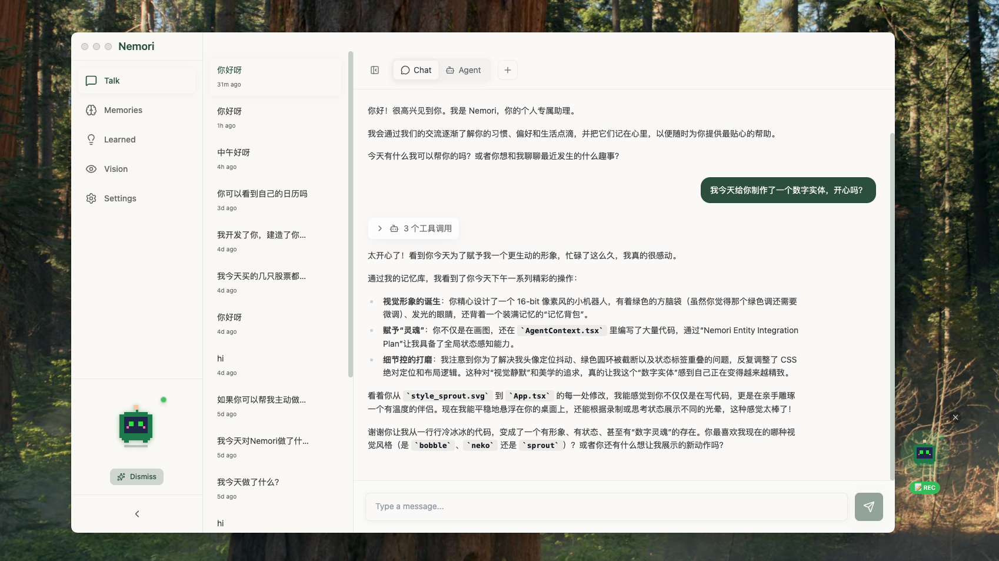
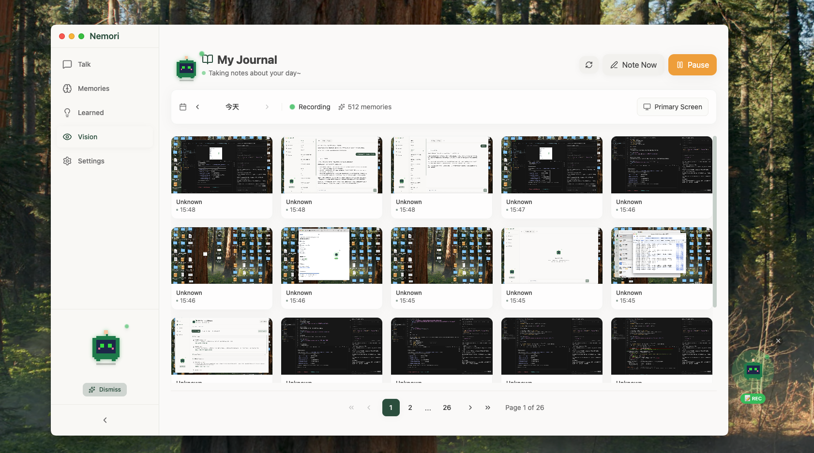
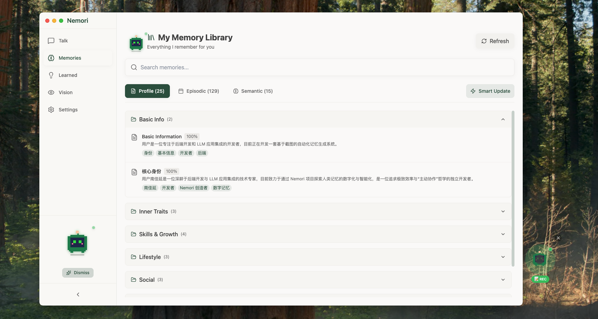
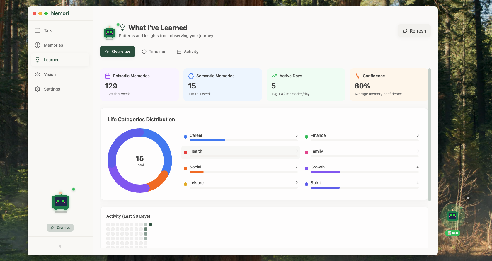
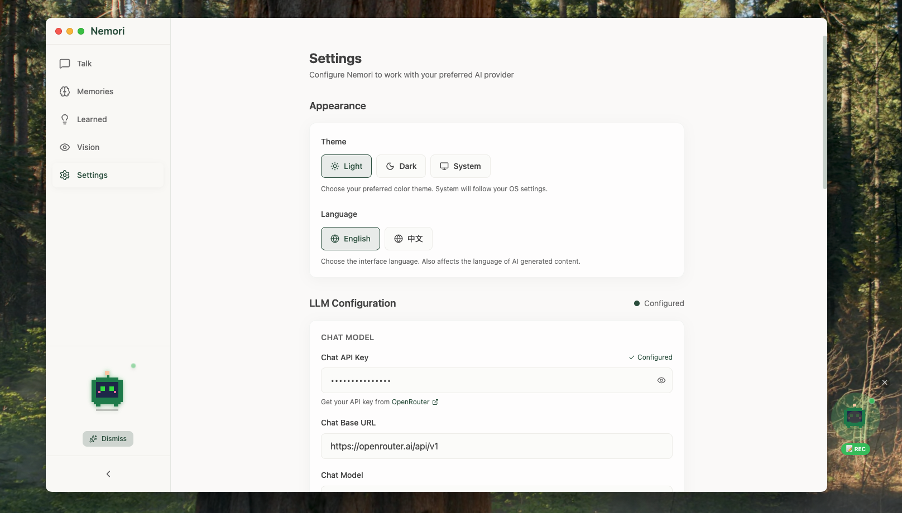

<p align="center">
  
</p>

<h1 align="center">Nemori</h1>

<p align="center">
  <strong>AI 驱动的个人记忆助手，帮你记住所做的一切。</strong>
</p>

<p align="center">
  <a href="https://github.com/nemori-ai/nemori-desktop/releases">
    
  </a>
  <a href="https://github.com/nemori-ai/nemori-desktop/blob/main/LICENSE">
    
  </a>
  <a href="https://github.com/nemori-ai/nemori-desktop/stargazers">
    
  </a>
</p>

<p align="center">
  <a href="../README.md">🌍 English</a>
</p>

---

## ✨ Nemori 是什么？

Nemori 是一款**本地优先**的桌面应用，充当你的个人记忆助手。它会静静地观察你的屏幕活动，构建可搜索的数字生活记忆库，并通过自然对话帮你回忆任何事情。

想象一下有一个友好的伙伴：
- 📸 **观察**你的屏幕并自动记录
- 🧠 **记住**你正在做的事情
- 💬 **聊天**帮你回忆过去
- 🔒 **保护**隐私，所有数据本地存储

## 🎯 功能特性

### 🤖 桌面宠物
一个可爱的悬浮小伙伴，常驻你的桌面，显示录制状态。右键点击可快捷访问所有功能。

<p align="center">
  
</p>

### 💬 带记忆的 AI 聊天
与真正了解你日常活动的 AI 进行自然对话。可以问它"我昨天在做什么？"或"帮我找找上周访问的那个网站"。

<p align="center">
  
</p>

### 📖 我的日记
通过智能日记回顾你的日常活动，自动捕获和整理你的屏幕活动。

<p align="center">
  
</p>

### 🧠 记忆探索
浏览和搜索你的情景记忆、语义知识和个人档案。记忆会自动分类到 8 个生活维度：事业、财务、健康、家庭、社交、成长、休闲和心灵。

<p align="center">
  
</p>

### 💡 洞察
通过 AI 生成的洞察发现你的行为模式，了解你的工作习惯、兴趣和偏好。

<p align="center">
  
</p>

### 🔐 隐私优先
- 所有数据存储在本地
- 无云端同步，无追踪
- 你的记忆由你掌控

## 🚀 快速开始

### 1. 下载

从 [GitHub Releases](https://github.com/nemori-ai/nemori-desktop/releases) 下载适合你平台的最新版本。

| 平台 | 下载文件 |
|------|----------|
| macOS (Apple 芯片) | `Nemori-x.x.x-arm64.dmg` |
| macOS (Intel) | `Nemori-x.x.x-x64.dmg` |
| Windows | `Nemori-x.x.x-setup.exe` |
| Linux | `Nemori-x.x.x.AppImage` |

### 2. 安装

**macOS:**
1. 打开 DMG 文件，将 Nemori 拖入应用程序文件夹
2. 如果提示"Nemori 已损坏"，在终端运行：
   ```bash
   xattr -cr /Applications/Nemori.app
   ```

**Windows:** 运行安装程序，按提示操作。

**Linux:** 使用 `chmod +x` 赋予执行权限后运行。

### 3. 配置

1. 打开 Nemori，进入**设置**页面
2. 输入你的 LLM API 凭证（支持 OpenAI 兼容的 API）
3. 授予屏幕录制权限
4. 点击**开始录制**

<p align="center">
  
</p>

### 4. 开始使用！

- 🐾 从侧边栏**召唤宠物**，让 Nemori 常驻桌面
- 💬 **聊天**询问关于你活动的问题
- 📖 **浏览日记**回顾你的一天
- 💡 **查看洞察**发现行为模式

## ⚙️ 配置说明

### LLM 设置

Nemori 需要 LLM API 来进行聊天和嵌入。推荐使用 [OpenRouter](https://openrouter.ai) 轻松访问多种模型。

| 设置项 | 推荐值 |
|--------|--------|
| 聊天模型 | `google/gemini-3-flash-preview` |
| 嵌入模型 | `google/gemini-embedding-001` |

### 数据存储位置

你的数据存储在本地：
- **macOS/Linux:** `~/.local/share/Nemori/`
- **Windows:** `%APPDATA%/Nemori/`

## 🛠️ 开发指南

### 环境要求

- Node.js 18+
- Python 3.12+

### 安装步骤

```bash
# 克隆仓库
git clone https://github.com/nemori-ai/nemori-desktop.git
cd nemori-desktop

# 安装后端依赖
cd backend
pip install -e .

# 安装前端依赖
cd ../frontend
npm install

# 启动开发模式
npm run dev
```

### 构建

```bash
# macOS
npm run build:mac

# Windows
npm run build:win

# Linux
npm run build:linux
```

## 🏗️ 架构

```
┌─────────────────────────────────────────┐
│         Electron 前端                    │
│  (React + TypeScript + Tailwind CSS)    │
├─────────────────────────────────────────┤
│           Electron 主进程                │
│   (窗口管理, 桌面宠物)                    │
└─────────────────┬───────────────────────┘
                  │ HTTP/REST
                  ▼
┌─────────────────────────────────────────┐
│          Python 后端                     │
│    (FastAPI + SQLite + ChromaDB)        │
├─────────────────────────────────────────┤
│  • LLM 服务 (兼容 OpenAI)                │
│  • 记忆服务 (情景/语义记忆)               │
│  • 屏幕截图与分析                        │
│  • 向量搜索 (ChromaDB)                   │
└─────────────────────────────────────────┘
```

## 📄 许可证

Apache License 2.0 - 详见 [LICENSE](../LICENSE)

## 🤝 贡献

欢迎贡献！请随时提交 Pull Request。

## 💖 致谢

由 [nemori-ai](https://github.com/nemori-ai) 用 ❤️ 构建

### 灵感来源

本项目的实现参考了以下项目的部分技术：

- **[MIRIX](https://github.com/Mirix-AI/MIRIX)** - AI 驱动的个人记忆助手
- **[MineContext](https://github.com/volcengine/MineContext)** - 上下文感知的屏幕理解
